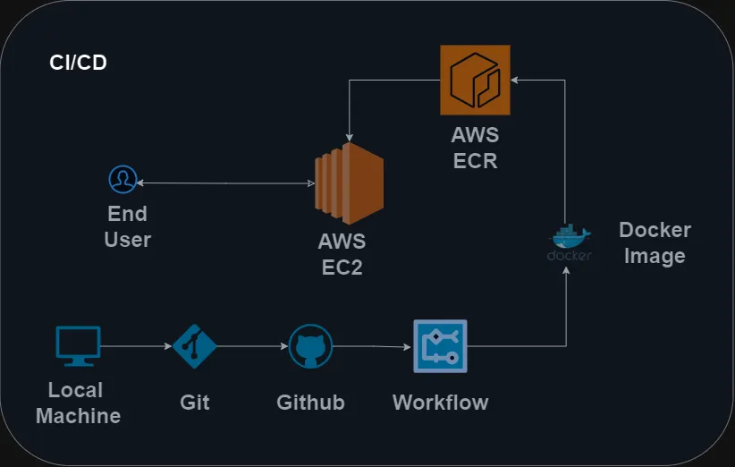

# gemini-n-db




# AWS-CICD-Deployment-with-Github-Actions

# End-to-end-ML-Project


## Workflows

1. update config.yaml
2. update schema.yaml
3. update params.yaml
4. update the entity 
5. update the configuration manager in src config
6. update the components
7. update the pipeline
8. update the main.py
9. update the app.py

# How to run?
### STEPS:


```bash
python3 -m venv ./gemdb
```

```bash
source gem-db/bin/activate
```

```bash
pip install -r requirements.txt
```

```bash
streamlit run app.py
```

```bash
Now open up http://localhost:8501
```

# AWS-CICD-Deployment-with-Github-Actions

## 1. Login to AWS console.

## 2. Create IAM user for deployment

	#with specific access

	1. EC2 access : It is virtual machine

	2. ECR: Elastic Container registry to save your docker image in aws


	#Description: About the deployment

	1. Build docker image of the source code

	2. Push your docker image to ECR

	3. Launch Your EC2 

	4. Pull Your image from ECR in EC2

	5. Lauch your docker image in EC2

	#Policy:

	1. AmazonEC2ContainerRegistryFullAccess

	2. AmazonEC2FullAccess

	
## 3. Create ECR repo to store/save docker image
    - Save the URI: 363869887563.dkr.ecr.us-east-1.amazonaws.com/gemini-n-db-ecr

	
## 4. Create EC2 machine (Ubuntu) 

## 5. Open EC2 and Install docker in EC2 Machine:
	
	
	#optional

    <!-- updates the package list  -->
	sudo apt-get update -y

    <!--  upgrades the already installed packages to their latest versions -->
	sudo apt-get upgrade
	
	#required

    <!-- download the docker file  -->
	curl -fsSL https://get.docker.com -o get-docker.sh

    <!--  runs the downloaded script  -->
	sudo sh get-docker.sh

    <!-- modifies the user account name -->
	sudo usermod -aG docker ubuntu

    <!-- changes the current group of the running shell to the group named docker -->
	newgrp docker
	
# 6. Configure EC2 as self-hosted runner:
    setting>actions>runner>new self hosted runner> choose os> then run command one by one
    
    - NOTES: Give the name of the runner as `self-hosted` and rest as default
    - if different name given, would through an error


# 7. Setup github secrets:

    AWS_ACCESS_KEY_ID=

    AWS_SECRET_ACCESS_KEY=

    AWS_REGION = us-east-1

    AWS_ECR_LOGIN_URI = demo>>  566373416292.dkr.ecr.ap-south-1.amazonaws.com

    ECR_REPOSITORY_NAME = simple-app


 git config --global user.name "entbappy"